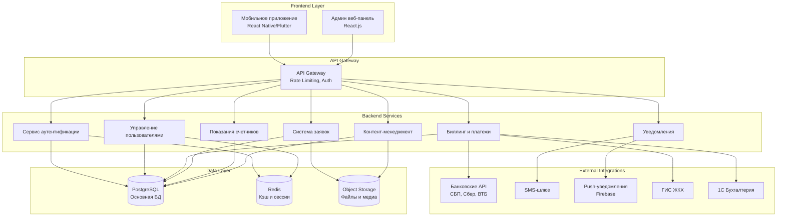

# Техническая архитектура мобильного приложения ЖК River Park

## 1. Общая архитектура системы

## 2. Технический стек

### Frontend (Мобильное приложение)
- **Платформа**: React Native
- **Навигация**: React Navigation 6
- **Состояние**: Redux Toolkit + RTK Query
- **UI Components**: React Native Elements / NativeBase
- **Локализация**: react-i18next

### Backend
- **Язык**: Python 3.11+
- **Framework**: FastAPI
- **ORM**: SQLAlchemy 2.0
- **Миграции**: Alembic
- **Валидация**: Pydantic v2
- **Аутентификация**: JWT + OAuth2

### База данных
- **Основная БД**: PostgreSQL 15+
- **Кэш**: Redis 7+
- **Файловое хранилище**: MinIO / Yandex Object Storage

### Инфраструктура
- **Контейнеризация**: Docker + Docker Compose
- **Оркестрация**: Kubernetes (для продакшена)
- **CI/CD**: GitHub Actions / GitLab CI
- **Мониторинг**: Prometheus + Grafana
- **Логирование**: ELK Stack

## 3. Безопасность

### Аутентификация и авторизация
- JWT токены (Access + Refresh)
- SMS-верификация при регистрации
- Двухфакторная аутентификация (опционально)
- Rate limiting для API

### Защита данных
- HTTPS/TLS 1.3
- Шифрование чувствительных данных в БД
- Соответствие 152-ФЗ "О персональных данных"
- GDPR compliance
- Регулярные аудиты безопасности

### API Security
- API Gateway с rate limiting
- CORS настройки
- Input validation и sanitization
- SQL injection protection
- XSS protection

## 4. Масштабирование

### Горизонтальное масштабирование
- Stateless backend сервисы
- Load balancer (Nginx/HAProxy)
- Database read replicas
- Микросервисная архитектура

### Кэширование
- Redis для сессий и часто запрашиваемых данных
- CDN для статических файлов
- Application-level кэширование

### Производительность
- Database indexing
- Query optimization
- Lazy loading для мобильного приложения
- Image optimization и compression

## 5. Мониторинг и отладка

### Метрики
- Application Performance Monitoring (APM)
- Database performance metrics
- API response times
- Error rates и crash reports

### Логирование
- Structured logging (JSON)
- Centralized log management
- Error tracking (Sentry)
- User analytics

## 6. Развертывание

### Environments
- **Development**: Local Docker Compose
- **Staging**: Kubernetes cluster
- **Production**: Kubernetes cluster with HA

### CI/CD Pipeline
1. Code commit → Git repository
2. Automated tests (unit, integration)
3. Docker image build
4. Security scanning
5. Deployment to staging
6. Automated E2E tests
7. Manual approval
8. Production deployment
9. Health checks

## 7. Интеграции

### Платежные системы
- **СБП (Система быстрых платежей)**
- **ЮKassa** - основной платежный провайдер
- **CloudPayments** - резервный провайдер
- **Банковские API**: Сбербанк, ВТБ, Дом.РФ

### Внешние сервисы
- **SMS**: SMS.ru / SMSC.ru
- **Push-уведомления**: Firebase Cloud Messaging
- **ГИС ЖКХ**: API интеграция для передачи данных
- **1С**: WebService интеграция

## 8. Требования к производительности

### SLA метрики
- **Uptime**: 99.9%
- **API Response Time**: < 500ms (95 percentile)
- **Mobile App Launch Time**: < 3 секунды
- **Database Query Time**: < 100ms (95 percentile)

### Нагрузочные характеристики
- **Concurrent Users**: до 1000 одновременных пользователей
- **Peak Load**: до 5000 запросов в минуту
- **Data Storage**: до 100GB данных в год
- **File Storage**: до 1TB медиафайлов