# Схема базы данных ЖК River Park

## ER-диаграмма основных сущностей

```mermaid
erDiagram
    USERS {
        uuid id PK
        string phone UK
        string email
        string first_name
        string last_name
        string middle_name
        string password_hash
        timestamp created_at
        timestamp updated_at
        boolean is_active
        boolean is_verified
        string verification_code
        timestamp verification_expires
    }
    
    APARTMENTS {
        uuid id PK
        string account_number UK "Лицевой счет"
        string building_number "Корпус 1 или 2"
        string apartment_number
        decimal area
        integer rooms_count
        string apartment_type "studio/1br/2br"
        timestamp created_at
        timestamp updated_at
        boolean is_active
    }
    
    USER_APARTMENTS {
        uuid id PK
        uuid user_id FK
        uuid apartment_id FK
        string role "owner/tenant/family"
        boolean is_primary
        timestamp created_at
        timestamp confirmed_at
        boolean is_confirmed
    }
    
    BILLS {
        uuid id PK
        uuid apartment_id FK
        string period "2025-01"
        decimal total_amount
        decimal paid_amount
        string status "pending/paid/overdue"
        json services_breakdown
        timestamp due_date
        timestamp created_at
        timestamp updated_at
    }
    
    PAYMENTS {
        uuid id PK
        uuid bill_id FK
        uuid user_id FK
        decimal amount
        string payment_method "card/sbp/bank"
        string transaction_id
        string status "pending/success/failed"
        json payment_details
        timestamp created_at
        timestamp processed_at
    }
    
    METER_READINGS {
        uuid id PK
        uuid apartment_id FK
        uuid user_id FK
        string meter_type "water_cold/water_hot/gas/electricity"
        decimal current_reading
        decimal previous_reading
        string period "2025-01"
        timestamp reading_date
        timestamp created_at
        boolean is_verified
    }
    
    TICKETS {
        uuid id PK
        uuid apartment_id FK
        uuid user_id FK
        string category "plumbing/electrical/cleaning/elevator/other"
        string title
        text description
        string priority "low/medium/high"
        string status "new/assigned/in_progress/completed/closed"
        uuid assigned_to FK
        timestamp created_at
        timestamp updated_at
        timestamp due_date
        timestamp completed_at
    }
    
    TICKET_ATTACHMENTS {
        uuid id PK
        uuid ticket_id FK
        string file_name
        string file_path
        string file_type
        integer file_size
        timestamp created_at
    }
    
    TICKET_COMMENTS {
        uuid id PK
        uuid ticket_id FK
        uuid user_id FK
        text comment
        timestamp created_at
        boolean is_internal
    }
    
    STAFF {
        uuid id PK
        string first_name
        string last_name
        string position
        string phone
        string email
        string specialization "plumber/electrician/cleaner/manager"
        boolean is_active
        timestamp created_at
    }
    
    NEWS {
        uuid id PK
        string title
        text content
        string category "news/announcement/document"
        boolean is_published
        timestamp published_at
        timestamp created_at
        timestamp updated_at
        uuid created_by FK
    }
    
    NEWS_ATTACHMENTS {
        uuid id PK
        uuid news_id FK
        string file_name
        string file_path
        string file_type
        timestamp created_at
    }
    
    NOTIFICATIONS {
        uuid id PK
        uuid user_id FK
        string type "push/sms/email"
        string title
        text message
        json data
        boolean is_read
        timestamp created_at
        timestamp read_at
        timestamp scheduled_at
    }
    
    AUTO_PAYMENTS {
        uuid id PK
        uuid user_id FK
        uuid apartment_id FK
        string payment_method
        json payment_details
        boolean is_active
        timestamp created_at
        timestamp updated_at
    }
    
    ADMIN_USERS {
        uuid id PK
        string username UK
        string email
        string password_hash
        string role "admin/manager/staff"
        json permissions
        boolean is_active
        timestamp created_at
        timestamp last_login
    }
    
    USERS ||--o{ USER_APARTMENTS : "has"
    APARTMENTS ||--o{ USER_APARTMENTS : "belongs to"
    APARTMENTS ||--o{ BILLS : "generates"
    BILLS ||--o{ PAYMENTS : "paid by"
    USERS ||--o{ PAYMENTS : "makes"
    APARTMENTS ||--o{ METER_READINGS : "has readings"
    USERS ||--o{ METER_READINGS : "submits"
    APARTMENTS ||--o{ TICKETS : "creates for"
    USERS ||--o{ TICKETS : "creates"
    STAFF ||--o{ TICKETS : "assigned to"
    TICKETS ||--o{ TICKET_ATTACHMENTS : "has"
    TICKETS ||--o{ TICKET_COMMENTS : "has"
    USERS ||--o{ TICKET_COMMENTS : "writes"
    ADMIN_USERS ||--o{ NEWS : "creates"
    NEWS ||--o{ NEWS_ATTACHMENTS : "has"
    USERS ||--o{ NOTIFICATIONS : "receives"
    USERS ||--o{ AUTO_PAYMENTS : "sets up"
    APARTMENTS ||--o{ AUTO_PAYMENTS : "for"
```



## Детальные описания таблиц

### Пользователи (USERS)
```sql
CREATE TABLE users (
    id UUID PRIMARY KEY DEFAULT gen_random_uuid(),
    phone VARCHAR(15) UNIQUE NOT NULL,
    email VARCHAR(255),
    first_name VARCHAR(100),
    last_name VARCHAR(100),
    middle_name VARCHAR(100),
    password_hash VARCHAR(255) NOT NULL,
    created_at TIMESTAMP DEFAULT CURRENT_TIMESTAMP,
    updated_at TIMESTAMP DEFAULT CURRENT_TIMESTAMP,
    is_active BOOLEAN DEFAULT true,
    is_verified BOOLEAN DEFAULT false,
    verification_code VARCHAR(6),
    verification_expires TIMESTAMP
);

CREATE INDEX idx_users_phone ON users(phone);
CREATE INDEX idx_users_email ON users(email);
```

### Квартиры (APARTMENTS)
```sql
CREATE TABLE apartments (
    id UUID PRIMARY KEY DEFAULT gen_random_uuid(),
    account_number VARCHAR(20) UNIQUE NOT NULL,
    building_number VARCHAR(10) NOT NULL, -- '1' или '2'
    apartment_number VARCHAR(10) NOT NULL,
    area DECIMAL(6,2) NOT NULL,
    rooms_count INTEGER,
    apartment_type VARCHAR(20) CHECK (apartment_type IN ('studio', '1br', '2br')),
    created_at TIMESTAMP DEFAULT CURRENT_TIMESTAMP,
    updated_at TIMESTAMP DEFAULT CURRENT_TIMESTAMP,
    is_active BOOLEAN DEFAULT true
);

CREATE INDEX idx_apartments_account ON apartments(account_number);
CREATE INDEX idx_apartments_building ON apartments(building_number);
```

### Связь пользователей и квартир (USER_APARTMENTS)
```sql
CREATE TABLE user_apartments (
    id UUID PRIMARY KEY DEFAULT gen_random_uuid(),
    user_id UUID REFERENCES users(id) ON DELETE CASCADE,
    apartment_id UUID REFERENCES apartments(id) ON DELETE CASCADE,
    role VARCHAR(20) DEFAULT 'resident' CHECK (role IN ('owner', 'tenant', 'family')),
    is_primary BOOLEAN DEFAULT false,
    created_at TIMESTAMP DEFAULT CURRENT_TIMESTAMP,
    confirmed_at TIMESTAMP,
    is_confirmed BOOLEAN DEFAULT false
);

CREATE UNIQUE INDEX idx_user_apartments_primary ON user_apartments(apartment_id) 
WHERE is_primary = true;
CREATE INDEX idx_user_apartments_user ON user_apartments(user_id);
```

### Счета (BILLS)
```sql
CREATE TABLE bills (
    id UUID PRIMARY KEY DEFAULT gen_random_uuid(),
    apartment_id UUID REFERENCES apartments(id) ON DELETE CASCADE,
    period VARCHAR(7) NOT NULL, -- '2025-01'
    total_amount DECIMAL(10,2) NOT NULL,
    paid_amount DECIMAL(10,2) DEFAULT 0,
    status VARCHAR(20) DEFAULT 'pending' CHECK (status IN ('pending', 'paid', 'overdue', 'partial')),
    services_breakdown JSONB,
    due_date DATE NOT NULL,
    created_at TIMESTAMP DEFAULT CURRENT_TIMESTAMP,
    updated_at TIMESTAMP DEFAULT CURRENT_TIMESTAMP
);

CREATE INDEX idx_bills_apartment ON bills(apartment_id);
CREATE INDEX idx_bills_period ON bills(period);
CREATE INDEX idx_bills_status ON bills(status);
CREATE UNIQUE INDEX idx_bills_apartment_period ON bills(apartment_id, period);
```

### Платежи (PAYMENTS)
```sql
CREATE TABLE payments (
    id UUID PRIMARY KEY DEFAULT gen_random_uuid(),
    bill_id UUID REFERENCES bills(id) ON DELETE CASCADE,
    user_id UUID REFERENCES users(id) ON DELETE SET NULL,
    amount DECIMAL(10,2) NOT NULL,
    payment_method VARCHAR(20) NOT NULL CHECK (payment_method IN ('card', 'sbp', 'bank_transfer')),
    transaction_id VARCHAR(100),
    status VARCHAR(20) DEFAULT 'pending' CHECK (status IN ('pending', 'success', 'failed', 'cancelled')),
    payment_details JSONB,
    created_at TIMESTAMP DEFAULT CURRENT_TIMESTAMP,
    processed_at TIMESTAMP
);

CREATE INDEX idx_payments_bill ON payments(bill_id);
CREATE INDEX idx_payments_user ON payments(user_id);
CREATE INDEX idx_payments_transaction ON payments(transaction_id);
```

### Показания счетчиков (METER_READINGS)
```sql
CREATE TABLE meter_readings (
    id UUID PRIMARY KEY DEFAULT gen_random_uuid(),
    apartment_id UUID REFERENCES apartments(id) ON DELETE CASCADE,
    user_id UUID REFERENCES users(id) ON DELETE SET NULL,
    meter_type VARCHAR(20) NOT NULL CHECK (meter_type IN ('water_cold', 'water_hot', 'gas', 'electricity')),
    current_reading DECIMAL(10,3) NOT NULL,
    previous_reading DECIMAL(10,3),
    period VARCHAR(7) NOT NULL, -- '2025-01'
    reading_date DATE DEFAULT CURRENT_DATE,
    created_at TIMESTAMP DEFAULT CURRENT_TIMESTAMP,
    is_verified BOOLEAN DEFAULT false
);

CREATE INDEX idx_meter_readings_apartment ON meter_readings(apartment_id);
CREATE INDEX idx_meter_readings_period ON meter_readings(period);
CREATE UNIQUE INDEX idx_meter_readings_unique ON meter_readings(apartment_id, meter_type, period);
```

### Заявки (TICKETS)
```sql
CREATE TABLE tickets (
    id UUID PRIMARY KEY DEFAULT gen_random_uuid(),
    apartment_id UUID REFERENCES apartments(id) ON DELETE CASCADE,
    user_id UUID REFERENCES users(id) ON DELETE SET NULL,
    category VARCHAR(30) NOT NULL CHECK (category IN ('plumbing', 'electrical', 'cleaning', 'elevator', 'heating', 'other')),
    title VARCHAR(200) NOT NULL,
    description TEXT,
    priority VARCHAR(10) DEFAULT 'medium' CHECK (priority IN ('low', 'medium', 'high', 'urgent')),
    status VARCHAR(20) DEFAULT 'new' CHECK (status IN ('new', 'assigned', 'in_progress', 'completed', 'closed', 'cancelled')),
    assigned_to UUID REFERENCES staff(id) ON DELETE SET NULL,
    created_at TIMESTAMP DEFAULT CURRENT_TIMESTAMP,
    updated_at TIMESTAMP DEFAULT CURRENT_TIMESTAMP,
    due_date TIMESTAMP,
    completed_at TIMESTAMP
);

CREATE INDEX idx_tickets_apartment ON tickets(apartment_id);
CREATE INDEX idx_tickets_user ON tickets(user_id);
CREATE INDEX idx_tickets_status ON tickets(status);
CREATE INDEX idx_tickets_assigned ON tickets(assigned_to);
```

## Индексы для производительности

```sql
-- Составные индексы для частых запросов
CREATE INDEX idx_bills_apartment_status ON bills(apartment_id, status);
CREATE INDEX idx_payments_bill_status ON payments(bill_id, status);
CREATE INDEX idx_tickets_status_created ON tickets(status, created_at DESC);
CREATE INDEX idx_meter_readings_apartment_period ON meter_readings(apartment_id, period);

-- Частичные индексы
CREATE INDEX idx_bills_unpaid ON bills(apartment_id) WHERE status IN ('pending', 'overdue');
CREATE INDEX idx_tickets_active ON tickets(apartment_id) WHERE status NOT IN ('completed', 'closed', 'cancelled');

-- Полнотекстовый поиск для заявок
CREATE INDEX idx_tickets_search ON tickets USING GIN(to_tsvector('russian', title || ' ' || COALESCE(description, '')));
```

## Триггеры и хранимые процедуры

```sql
-- Автоматическое обновление updated_at
CREATE OR REPLACE FUNCTION update_updated_at_column()
RETURNS TRIGGER AS $$
BEGIN
    NEW.updated_at = CURRENT_TIMESTAMP;
    RETURN NEW;
END;
$$ LANGUAGE plpgsql;

CREATE TRIGGER update_bills_updated_at
    BEFORE UPDATE ON bills
    FOR EACH ROW
    EXECUTE FUNCTION update_updated_at_column();

-- Обновление статуса счета при оплате
CREATE OR REPLACE FUNCTION update_bill_status()
RETURNS TRIGGER AS $$
BEGIN
    IF NEW.status = 'success' AND OLD.status != 'success' THEN
        UPDATE bills 
        SET paid_amount = paid_amount + NEW.amount,
            status = CASE 
                WHEN paid_amount + NEW.amount >= total_amount THEN 'paid'
                ELSE 'partial'
            END
        WHERE id = NEW.bill_id;
    END IF;
    RETURN NEW;
END;
$$ LANGUAGE plpgsql;

CREATE TRIGGER update_bill_on_payment
    AFTER UPDATE ON payments
    FOR EACH ROW
    EXECUTE FUNCTION update_bill_status();
```